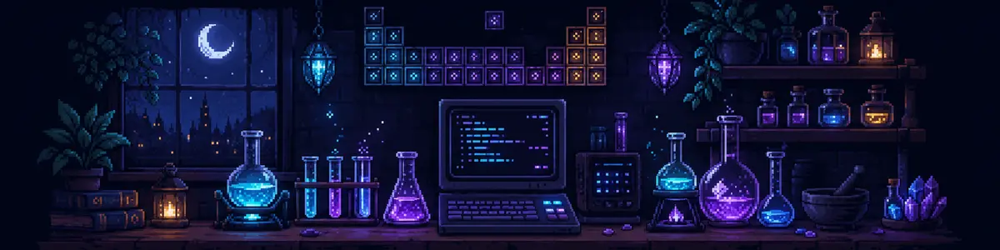
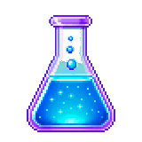

  

<h1 align="center">Avexzz</h1>

  Chemistry student turning science, pixels and code into unusual tools.

  <code>React</code>&nbsp;
  <code>TypeScript</code>&nbsp;
  <code>Node.js</code>&nbsp;
  <code>Electron</code>&nbsp;
  <code>Supabase</code>

### Somewhere between a laboratory and a terminal

- Exploring chemistry through code, experiments and visual tools.
- Building desktop apps, creative utilities and AI-assisted tools.
- Interested in interfaces that feel playful without sacrificing function.
- Currently preparing **Molaris**, an aesthetic desktop companion for chemistry.

### Current experiment

#### Molaris

An offline-first chemistry workspace with stoichiometry, dilution and molar-mass tools, an interactive periodic table, experiment timers and a visual laboratory notebook.

`status: concept and visual system`

### What belongs here

Projects with a clear identity, a real use and a little unnecessary magic.

 

  Made after midnight, usually with too many tabs open.

