  

  software, visual experiments &amp; things that probably started as a bad idea

  

---

### `01 — about`

> ◇ desktop apps, extensions, creative tools and experiments  
> ◇ simple software with useful features and interfaces with personality  
> ◇ every finished project includes clear setup and usage instructions

### `02 — current build`

> **molaris** — an offline-first chemistry desktop application  
> calculations · periodic table · laboratory notebook · timers

`status: designing the system`

### `03 — toolbox`

`react` · `typescript` · `node.js` · `electron` · `vite` · `supabase`

---

  build something useful. make it look good. keep it fast.

